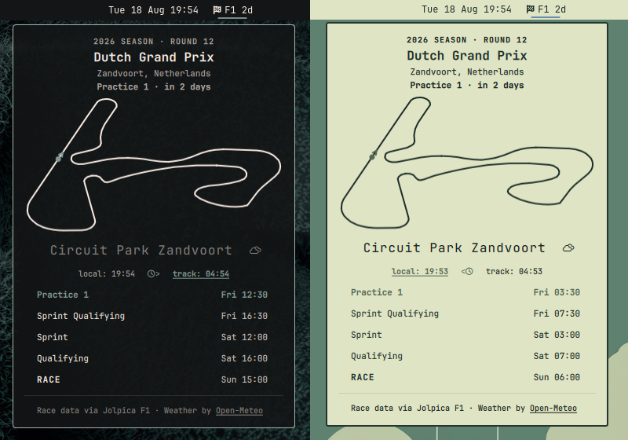

# Next Race for Omarchy

An Omarchy bar widget that shows the next race weekend on your bar. The pill displays a live countdown to the next session; clicking it opens a panel with the race details, weekend schedule, track map, and current weather conditions at the circuit. You can toggle between local and track time for all session times.

Currently only supports Formula 1 races.



## Requirements

- Omarchy with the Quattro shell plugin system
- An internet connection for race data (cached on disk for offline use)

## Install

Review the source before installing. Omarchy plugins run as unsandboxed code inside the long-running shell process.

```bash
omarchy plugin add https://github.com/salmun-nister/omarchy-next-race.git --enable
```

The widget is placed in the center bar section by default. If it was installed without `--enable`, enable it later:

```bash
omarchy plugin enable salmun-nister.next-race --section center
```

## Usage

- Left-click the pill to open or close the race panel.
- Middle-click the pill to refresh data.
- In the panel, the weekend schedule highlights the next session and dims past sessions.
- Toggle between local time and track time using the time display below the track map. Click on the time you'd like to use, or click the clock icon to toggle.
- During the off-season, the widget shows the first race of the next season.

## Update

```bash
omarchy plugin update salmun-nister.next-race
```

## Remove

```bash
omarchy plugin remove salmun-nister.next-race
```

Removal deletes only the plugin checkout and removes the widget from the Omarchy bar configuration. It does not remove any other data.

## Future Considerations

- Support additional racing series.
- Generate circuit geometry data at run-time when new tracks are added (currently requires a manual build step and plugin update).

Have a feature idea or found a bug? [Open an issue](https://github.com/salmun-nister/omarchy-next-race/issues).

## Acknowledgments

- [Jolpica F1 API](https://jolpi.ca) — race calendar and session data
- [Open-Meteo](https://open-meteo.com/) — weather and timezone data (CC-BY 4.0)
- [bacinger/f1-circuits](https://github.com/bacinger/f1-circuits) — track layout geometry (MIT)
- [OpenCode](https://opencode.ai) Big Pickle — development assistant

Formula 1, FORMULA ONE, FIA FORMULA ONE WORLD CHAMPIONSHIP, GRAND PRIX and related marks are trademarks of Formula One Licensing B.V. This plugin is unofficial and not affiliated with, endorsed, or approved by Formula One, the FIA, or Formula One Licensing B.V.

## License

[MIT](LICENSE)
